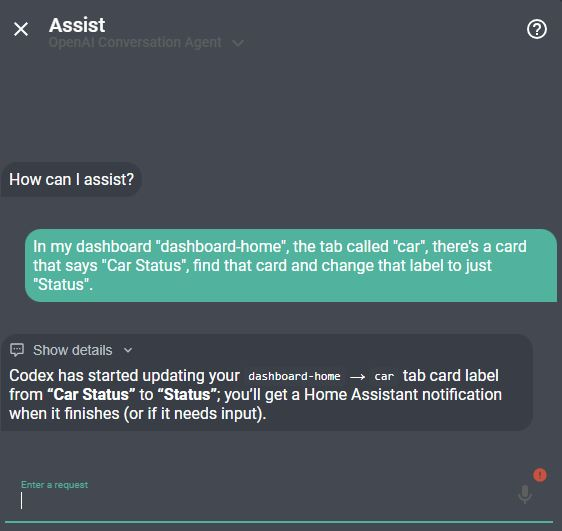
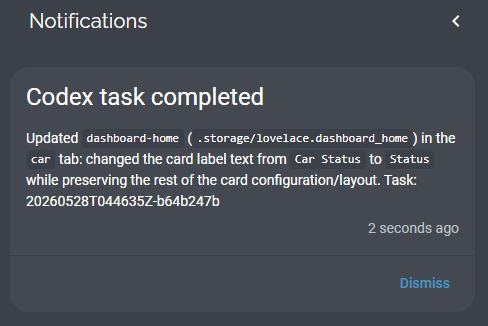

# Codex for Home Assistant

Run Codex CLI against your Home Assistant configuration folder from Home Assistant.

This repository contains two pieces:

- `codex-cli-worker`: a Home Assistant app/add-on that runs Codex CLI with read-write access to `/config`.
- `custom_components/codex_cli`: a Home Assistant custom integration that exposes entities and actions for starting tasks, checking status, signing in, cancelling work, and replying when Codex needs input.

## What It Does

- Starts Codex tasks from Home Assistant actions, scripts, automations, or Assist/LLM tools.
- Mounts the Home Assistant config folder as `/config` inside the worker app.
- Runs tasks non-interactively and stores task logs/results under `/config/codex_tasks`.
- Supports Codex device-code sign-in through Home Assistant persistent notifications.
- Reports active task count, latest task status, auth status, and task-running state.
- Uses Home Assistant Ingress for the app UI; the worker HTTP port is not exposed to the LAN.

## Example Flow

Ask Home Assistant Assist to make a configuration or dashboard change:



Codex runs the task and sends a Home Assistant notification when it finishes:



## Security Notes

This app is powerful by design. It gives Codex access to your Home Assistant config folder so it can edit automations, scripts, dashboards, integrations, and related files.

The packaged worker follows the current Home Assistant app security guidance:

- No published LAN port.
- Ingress enabled for the web UI.
- Exact Ingress proxy source validation.
- Token-protected worker API for non-Ingress calls.
- AppArmor enabled with a custom profile.
- No Docker API access.
- No host network.
- No host PID/UTS access.
- No `full_access`.
- No elevated Supervisor role.

The `/config` mount is intentionally read-write because editing Home Assistant configuration is the core purpose of the project.

## Supported Architectures

Prebuilt app images are published for:

- `amd64`
- `aarch64`

## Installation

### 1. Add the Worker App Repository

[](https://my.home-assistant.io/redirect/supervisor_add_addon_repository/?repository_url=https%3A%2F%2Fgithub.com%2Fmoryoav%2Fhome-assistant-codex)

Use the button above to add this repository to Home Assistant's Apps store.

If you prefer to do it manually:

In Home Assistant:

1. Go to **Settings** -> **Apps**.
2. Open the menu in the top right.
3. Choose **Repositories**.
4. Add this repository URL:

```text
https://github.com/moryoav/home-assistant-codex
```

### 2. Install and Start the Worker App

[](https://my.home-assistant.io/redirect/supervisor_addon/?addon=8a8d906b_codex_cli_worker&repository_url=https%3A%2F%2Fgithub.com%2Fmoryoav%2Fhome-assistant-codex)

Use the button above after adding the repository. It opens the **Codex CLI Worker** app page.

1. Install **Codex CLI Worker**.
2. Review the app options.
3. Start the app.

The app keeps an internal worker API token in private app storage. The **Codex** integration provisions and rotates that token automatically through Home Assistant's Supervisor-managed app stdin, so you do not need to view, copy, or configure a token.

The app's web UI is available through Home Assistant Ingress. Do not try to open port `9123` directly; it is intentionally not exposed.

### 3. Sign In to Codex

Before starting sign-in, enable **Enable device code authorization for Codex** in ChatGPT:

1. Open the ChatGPT website.
2. Click your profile.
3. Go to **Settings** -> **Security**.
4. Turn on **Enable device code authorization for Codex** near the bottom of the page.

This setting is in ChatGPT, not the Codex website.

Open the app web UI and click **Start login**, or call the `codex_cli.start_login` action after the integration is installed.

The app sends a Home Assistant persistent notification with:

- A QR code.
- A sign-in link.
- The one-time device code.

Scan the QR code or open the link, then enter the device code shown in the notification.

Codex CLI sign-in uses your ChatGPT/OpenAI account. It may work with a free ChatGPT account, but **ChatGPT Plus or higher is recommended** for more reasonable usage limits. This project does not use OpenAI API keys for Codex tasks.

### 4. Install the Custom Integration

#### HACS

[](https://my.home-assistant.io/redirect/hacs_repository/?owner=moryoav&repository=home-assistant-codex&category=integration)

Use the button above to add and open the Codex custom repository in HACS.

If you prefer to do it manually:

1. Open HACS.
2. Add a custom repository.
3. Use this URL:

```text
https://github.com/moryoav/home-assistant-codex
```

4. Select category **Integration**.
5. Install **Codex**.
6. Restart Home Assistant.

#### Manual

Copy:

```text
custom_components/codex_cli
```

to:

```text
/config/custom_components/codex_cli
```

Then restart Home Assistant.

### 5. Add the Integration

[](https://my.home-assistant.io/redirect/config_flow_start/?domain=codex_cli)

Use the button above after Home Assistant restarts. It opens the **Codex** integration setup flow.

In Home Assistant:

1. Go to **Settings** -> **Devices & services**.
2. Add integration **Codex**.

The integration auto-detects the installed worker app and provisions its internal worker API token. There is no worker URL or API token to enter.

## Actions

The integration exposes these Home Assistant actions:

- `codex_cli.start_task`
- `codex_cli.start_login`
- `codex_cli.get_login_status`
- `codex_cli.list_tasks`
- `codex_cli.get_task`
- `codex_cli.cancel_task`
- `codex_cli.reply_task`

Example:

```yaml
action: codex_cli.start_task
data:
  prompt: Check my Home dashboard for broken cards and suggest fixes.
response_variable: codex_result
```

## Assist / LLM Script Example

See [examples/scripts.yaml](examples/scripts.yaml) for a starter script you can expose to Assist or another LLM integration.

## Publishing Images

The repository includes a GitHub Actions workflow that builds and publishes multi-architecture images to GitHub Container Registry:

```text
ghcr.io/moryoav/codex-cli-worker
```

The app `config.yaml` points at that image. Home Assistant uses the app version as the image tag.

## Development Layout

```text
.
├── codex-cli-worker/
│   ├── config.yaml
│   ├── Dockerfile
│   ├── server.py
│   └── ...
├── custom_components/
│   └── codex_cli/
├── examples/
├── repository.yaml
└── hacs.json
```
